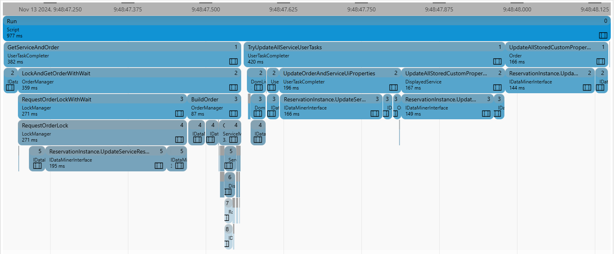
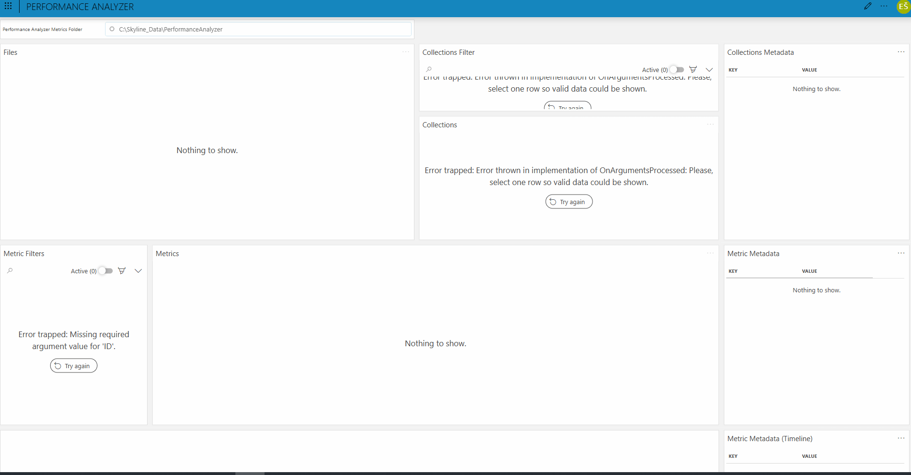

### Performance Analyzer

#### Overview

The [Performance Analyzer NuGet](https://www.nuget.org/packages/Skyline.DataMiner.Utils.PerformanceAnalyzer) allows you to gather the performance metrics for a solution you have implemented, but collecting the data is only one piece of the puzzle. For the collected metrics to bring value, you need to be able to interpret them and use them easily for decision-making. As humans, we often struggle to comprehend numbers, particularly when they are extremely large or, as is often the case with performance metrics, very small. This makes it essential to provide a more **intuitive way to interpret the data**. This Performance Analyzer package helps you with this by providing a **low-code app that visualizes the metrics out of the box** along with a **collection of GQI queries that allow for custom visualizations**, tailored to the specific requirements of a project.

> [!IMPORTANT]
> This package supplements the [Performance Analyzer NuGet](https://www.nuget.org/packages/Skyline.DataMiner.Utils.PerformanceAnalyzer). Implementing it in your code is a prerequisite.

> [!NOTE] 
> For a detailed introduction to the Performance Analyzer NuGet and to DataMiner Low-Code Apps, refer to DataMiner Docs:
>
> - [Performance Analyzer](https://aka.dataminer.services/Performance_Analyzer)
> - [DataMiner Low-Code Apps](https://aka.dataminer.services/Low_Code_Apps)

#### Use Cases

- **Monitoring**: The Performance Analyzer allows **continuous monitoring of your solution’s performance**, providing real-time insights into critical metrics. By visualizing these metrics, you can quickly identify performance trends, detect potential issues before they impact the system, and **ensure the solution meets expected performance standards**. This supports proactive management and optimization, helping to maintain system reliability and enhance the user experience.
- **Debugging**: The Performance Analyzer aids in **pinpointing performance-related issues** by providing detailed metric visualizations that highlight bottlenecks and inefficiencies in the system. Through targeted data analysis, it enables a deeper understanding of the underlying causes of performance drops, helping to **accelerate the debugging process**. By visualizing these metrics, you can more easily trace issues back to specific components, optimize resource allocation, and ensure smoother, more reliable performance in your solution.

> [!NOTE]
> The [Performance Analyzer](https://github.com/SkylineCommunications/Skyline.DataMiner.Utils.PerformanceAnalyzer) library is an open-source project. Pull requests are welcomed.

#### Prerequisites

To deploy this integration from the Catalog:

- **DataMiner** version 10.2.7 or higher must be installed.
- The **Performance Analyzer NuGet** must be implemented in your code.

#### Installation and Configuration

##### Step 1: Implement the Performance Analyzer NuGet

Refer to the [Performance Analyzer readme](https://github.com/SkylineCommunications/Skyline.DataMiner.Utils.PerformanceAnalyzer/blob/3.0.X/README.md) for detailed information on how to implement the Performance Analyzer NuGet.

##### Step 2: Deploy the Performance Analyzer Low-Code App

1. Click the **Deploy** button to deploy the package directly to your DataMiner System.
2. Optionally, go to [admin.dataminer.services](https://admin.dataminer.services/) and verify whether the deployment was successful.

##### Step 3: Access the Performance Analyzer Low-Code App

1. Go to `http(s)://[DMA name]/root`.
1. Select *Performance Analyzer* to start using the application.

#### Using the Application

To view your metrics, begin by specifying the path to your Performance Analyzer logs. Once this is done, you can visualize the execution of a specific method by selecting the relevant log file, locating the run where the execution took place, and double-clicking the method you want to visualize.

#### Support

For additional help, reach out to support at [techsupport@skyline.be](mailto:techsupport@skyline.be)
